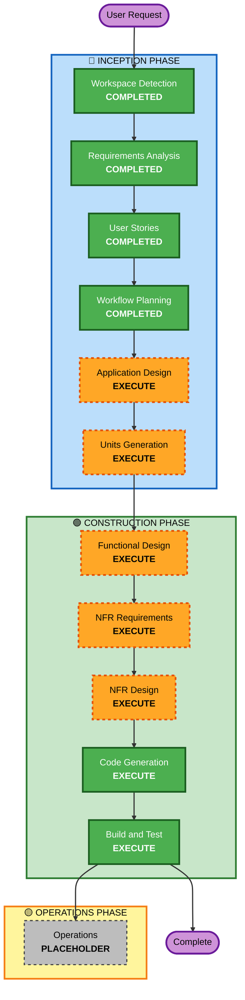

# Execution Plan

## Detailed Analysis Summary

### Change Impact Assessment
- **User-facing changes**: Yes — Three distinct client UIs (Mobile, Web, CLI) with shared core feature set
- **Structural changes**: Yes — New multi-package TypeScript architecture (shared core + platform adapters)
- **Data model changes**: Indirect — Domain models for Firefly III resources (transactions, accounts, categories, reports)
- **API changes**: Yes — Firefly III API client layer needed for all clients
- **NFR impact**: Yes — Security (token storage, TLS, fail-closed), testing (property-based + example-based)

### Risk Assessment
- **Risk Level**: Medium
- **Rollback Complexity**: Low — Greenfield; code can be iterated without migration concerns
- **Testing Complexity**: Moderate — Multi-platform testing but shared core reduces duplication

## Workflow Visualization



### Text Alternative
```
🔵 INCEPTION PHASE
  [✓] Workspace Detection (COMPLETED)
  [✓] Requirements Analysis (COMPLETED)
  [✓] User Stories (COMPLETED)
  [✓] Workflow Planning (COMPLETED)
  [→] Application Design (EXECUTE)
  [→] Units Generation (EXECUTE)

🟢 CONSTRUCTION PHASE (per-unit loop)
  [→] Functional Design (EXECUTE, per-unit)
  [→] NFR Requirements (EXECUTE, per-unit)
  [→] NFR Design (EXECUTE, per-unit)
  [→] Code Generation (EXECUTE, per-unit)
  [→] Build and Test (EXECUTE, after all units)

🟡 OPERATIONS PHASE
  [–] Operations (PLACEHOLDER)
```

## Phases to Execute

### 🔵 INCEPTION PHASE
- [x] Workspace Detection (COMPLETED)
- [x] Reverse Engineering (SKIPPED — Greenfield)
- [x] Requirements Analysis (COMPLETED)
- [x] User Stories (COMPLETED)
- [x] Workflow Planning (IN PROGRESS)
- [ ] Application Design — EXECUTE
  - **Rationale**: New multi-client architecture requires component decomposition (shared core + platform adapters), service layer design, and component method definitions
- [ ] Units Generation — EXECUTE
  - **Rationale**: Complex multi-package structure (shared core, mobile client, web client, CLI client) needs decomposition into well-defined units of work with dependency ordering

### 🟢 CONSTRUCTION PHASE
- [ ] Functional Design — EXECUTE (per-unit)
  - **Rationale**: New domain models, business logic, and data flow design needed for each unit
- [ ] NFR Requirements — EXECUTE (per-unit)
  - **Rationale**: Tech stack selection, security library choices, platform-specific storage decisions
- [ ] NFR Design — EXECUTE (per-unit)
  - **Rationale**: Security patterns (secure storage, fail-closed), property-based testing architecture per unit
- [ ] Infrastructure Design — SKIP
  - **Rationale**: Client-only application; no server infrastructure or deployment architecture needed
- [ ] Code Generation — EXECUTE (ALWAYS)
  - **Rationale**: Implementation planning and code generation for all units
- [ ] Build and Test — EXECUTE (ALWAYS)
  - **Rationale**: Build configuration, unit tests, integration tests, property-based tests

### 🟡 OPERATIONS PHASE
- [ ] Operations — PLACEHOLDER
  - **Rationale**: Future deployment and monitoring workflows

## Estimated Timeline
- **Total Phases**: 9 phases (4 complete + 1 skip + 4 remaining Inception + 5 Construction)
- **Estimated Duration**: Multiple sessions — depends on unit complexity and iteration feedback

## Success Criteria
- **Primary Goal**: Working TypeScript client suite connecting to Firefly III from Mobile, Web, and CLI
- **Key Deliverables**:
  - Shared core library (API client, domain models, validation, serialization)
  - Mobile app (React Native) with secure token storage
  - Web app (responsive SPA) with session-based token storage
  - CLI tool with interactive and scriptable modes
  - Property-based tests for pure logic + example-based tests for critical flows
- **Quality Gates**:
  - All Security Baseline extension rules enforced
  - Property-based tests covering PBT-REQ-01 to PBT-REQ-03
  - No credentials, tokens, or secrets in logs or error messages
  - All authenticated operations fail closed on missing/invalid config
